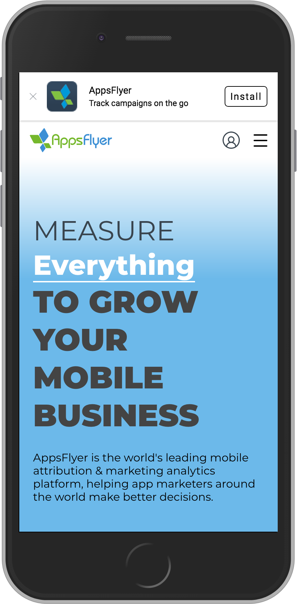

AppsFlyer Web App Banner Generator
==================================

Web-to-App Banner Generator for converting your mobile web users into app installs. Powered by OneLink.

# Table of Contents
- [Introduction](#introduction)
- [Installation](#installation)
    - [Required files](#required-files)
- [Usage](#usage)
    - [Creating your banner](#creating-your-banner)
- [Available Parameters](#available-parameters)
    - [Banner Settings](#banner-settings)
    - [Attribution Parameters](#attribution-parameters)
    - [Deep Linking Parameters](#deep-linking-parameters)
- [Troubleshooting](#troubleshooting)
- [Support](#support)
- [License](#license)

# Introduction
The AppsFlyer Web-to-App Banner Generator allows you to easily create a mobile app promotional banner on your webpage. This banner will be displayed to your mobile web users, inviting them to download your mobile app. Using OneLink deferred deep linking, users who click on the link will be sent to the right environment for their device. Users who do not have the app installed will first be sent to the correct app store for their operating system. When the app is installed, OneLink opens the app in the optimal place, page or state.

<p align="center">
   
</p>

Banners include a working, properly formatted tracking link based on your OneLink settings and a set of user-configured banner configuration.


# Installation
AppsFlyer recommends using the minified .min.js and .min.css versions of the banner generator.

### Required files
* appsflyer-banner.min.js
* appsflyer-banner.min.css


# Usage
In your webpage HTML file, include the following inside the `<head>` element:
```html
<script type="text/javascript" src="appsflyer-banner.min.js"></script>
<link rel="stylesheet" href="appsflyer-banner.min.css">
```

### Creating your banner
The following easy steps should be followed in order to create your banner:

1. Setup a **OneLink Configuration** for your apps in the AppsFlyer Dashboard. For more information about how to setup OneLink see our <a href="https://support.appsflyer.com/hc/en-us/articles/207032246-OneLink-Basic-Setup-Guide" target="_blank">OneLink Help Center article</a>.

2. Create a banner container element in your HTML file that will contain the banner, e.g.:
```html
<body>
    <div id="my-banner"></div>
    ...
</body>
```

3. Create an AppsFlyer banner object, using:
```js
var banner = new AFBanner();
```

4. Create a settings JSON object, which includes the banner general settings , attribution parameters and deep link parameters (see [Available Parameters](#available-parameters)). Example settings object:
```js
var settings = {
    // banner settings
    title: "AppsFlyer",
    subtitle: "Track campaigns on the go",
    app_icon: "img/app_icon.png",
    call_to_action: "Install",
    show_only_mobile: true,
    
    // attribution settings
    media_source: "banner_pid",
    campaign: "banner_c",
    adset: "banner_adset",
    adset_id: "banner_adset_id",
    ad: "banner_ad",
    ad_id: "banner_ad_id",
    site_id: "banner_site_id",
    sub1: "banner_sub1",
    
    // routing settings
    onelink_id: "pGHC",
    subdomain: "appsflyer",
    mobile_deeplink: "appsflyer://"
};
```

5. Initialize the banner using the `init` function, and passing both container ID and banner settings object.
```js
banner.init("my-banner", settings);
``` 


# Available Parameters

### Banner Settings
| Parameter | Type | Description |
|:---|:---|:---|
| title | `String` | The banner's title text |
| subtitle | `String` | (optional) The text that will appear below the title |
| app_icon | `String` | URL or image file location of the app that you wish to install |
| call_to_action | `String` | The text that will be displayed in the action button, e.g. `Install` |
| show_only_mobile | `Boolean` | if set to `true`, the banner will be shown only on mobile devices |


### Attribution Parameters
| Parameter | Type | Description |
|:---|:---|:---|
| media_source <span style="color:#009fdf">**(required)**</span> | `String` | Media Source (`pid`)|
| campaign | `String` | Campaign |
| adset | `String` | Adset |
| adset_id | `String` | Adset ID |
| ad | `String` | Ad |
| ad_id | `String` | Ad ID |
| site_id | `String` | Site ID |
| sub1 | `String` | Customizable parameter (`af_sub1`) |


### Deep Link Parameters
| Parameter | Type | Description |
|:---|:---|:---|
| onelink_id <span style="color:#009fdf">**(required)**</span>| `String` | OneLink Configuration ID |
| subdomain | `String` | Your OneLink ID's sub-domain |
| mobile_deeplink | `String` | Mobile deep link URL (`af_dp`) |


# Troubleshooting
*My banner isn't showing*
* Make sure that all mandatory parameters have been provided
* If you are on desktop check that `show_only_mobile` is set to `false`

*My banner link is broken*
* The OneLink subdomain must be the same subdomain defined in the provided OneLink ID's configuration.  Any mismatch between the subdomain and OneLink ID will result in a broken link.

*The banner is showing on desktop*
* Use the `show_only_mobile` parameter to display the banner only on mobile devices.


# Support
For any questions or help reach out to us at [support@appsflyer.com](support@appsflyer.com).


# License
MIT Licensed. Copyright (c) 2018 AppsFlyer, <a href="http://www.appsflyer.com" target="_blank">http://www.appsflyer.com</a>